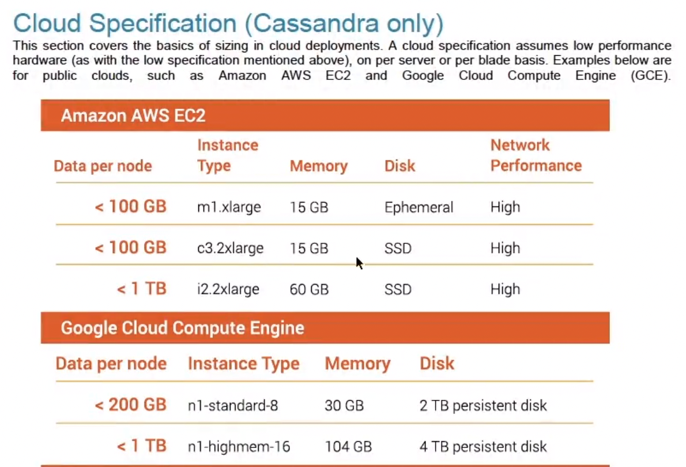

## Hardware

Knows the minimum Recommendation for RAM, CPU, storage

- minimum 8GB RAM per node required, 32GB common in production
- highly concurrent, minimum 4 cores, production 8 or more cores
- storage:
  - don't use shared storage
  - SSD is preferred than spinning disk
  - better to have more nodes, each with less data (500 ~ 1TB per node)
  - **separate drive for commit log** to maximize write performance (diskhead does not need to movel, continuously appending, spinning disk OK)

