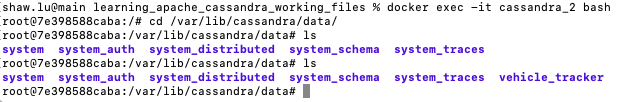
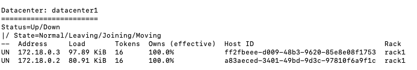

## Cassandra Cluster

- each node is identical to others in cluster (easy to add)
- must have same cluster name as existing cluster
- must have the IP address and network access to at least one of the nodes in the cluster
- network connection 1000 megabits / s recommended
- port 7000 for intra-node communication (gossip)
- port 9042: native binary protocol client
- port 9160: thrift client
- port 7199: JMX monitoring

---

## Docker Container

- see docker [guide](https://stackoverflow.com/questions/69844481/how-to-add-some-nodes-to-existing-cluster-on-cassandra-in-docker)

```bash
# first node, expose 9042 to host. Use itself as the seed node
# Watch the log to make sure it comes up.
# cluster name is "Test Cluster" by default (see cluster_name in cassandra.yaml)
docker run --rm \
  --name cassandra_1 \
  --network cassandra \
  -d -v "$(pwd)/:/home/" \
  -p 9042:9042 \
  cassandra

docker exec -it cassandra_1 bash
/opt/cassandra/bin/cqlsh

docker logs cassandra_1

# print node status every 2 second
watch -n 2 /opt/cassandra/bin/nodetool status
```

Create a second node

- adding a node to a cluster is called "bootstrapping"
- must have the same cluster name
- must be on a network on which it can connect to at least one of the seed nodes
- will take responsibility on the token range, if `auto_bootstrap=true` (by default)

```bash
# Then create the second node with the same command, but alter the name.
# do not try to bind to host's 9042 again
docker run --rm \
  --name cassandra_2 \
  --network cassandra \
  -d -v "$(pwd)/:/home/" \
  -e CASSANDRA_SEEDS=cassandra_1 \
  cassandra

docker exec -it cassandra_2 bash

# should not have any data
cd /var/lib/cassandra/data/
```

### Create Keyspace

From node cassandra_1, using cqlsh shell to create keyspace, table, and ingest data.

```sql
create keyspace vehicle_tracker
with replication = {
  'class': 'SimpleStrategy',
  'replication_factor': 2
};

use vehicle_tracker;

create table location (
vehicle_id text,
date text,
time timestamp,
latitude double,
longitude double,
primary key ((vehicle_id, date), time)
) with clustering order by (time desc);

COPY location (vehicle_id, date, time, latitude, longitude)
FROM '/home/Chapter 8/coordinates.csv' WITH header = true AND delimiter = '|';

```

Check in cassandra shell that the data have been created:

```bash
docker exec -it cassandra_2 bash

# should have some data
cd /var/lib/cassandra/data/
ls
```




---

## Manual Bootstrap

- the `/opt/cassandra/config/cassandra.yaml` on each node must be assigned the `listen_address` and `rpc_address` as the node's IP
- `listen_address` is for other cassandra nodes
- `rpc_address` is for client application

### Seed Node

- seed nodes offer their IP address for other nodes to join the cluster
- new node may have more than one seed node, in case some nodes are down
- in `/opt/cassandra/config/cassandra.yaml`

```yaml
# any class that implements the SeedProvider interface and has a
# constructor that takes a Map<String, String> of parameters will do.
seed_provider:
  # Addresses of hosts that are deemed contact points.
  # Cassandra nodes use this list of hosts to find each other and learn
  # the topology of the ring.  You must change this if you are running
  # multiple nodes!
  - class_name: org.apache.cassandra.locator.SimpleSeedProvider
    parameters:
      # seeds is actually a comma-delimited list of addresses.
      # Ex: "<ip1>,<ip2>,<ip3>"
      - seeds: 'cassandra_1'
```

- simply run `bin/cassandra -f` after setting the required property in `cassandra.yaml`

---

## Clean Up a Node

- tell cassandra node to remove data that it is no longer responsible for
- common to do after adding nodes to cluster, telling old nodes to disown token range

```
/opt/cassandra/bin/
nodetool -h 172.18.0.3 cleanup
nodetool -h cassandra cleanup
```
