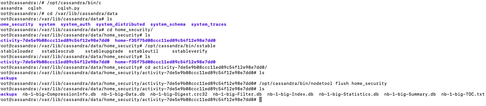

## Persistance

- write is first appended to commit log
- then into memcache
- then written into SSTable on disk (when memcache is full)
- there's a memcache for each table in each node
- sstable is in `/var/lib/cassandra/data`
- `bin/sstable2json` is deprecated in Cassandra 4.0

```bash
# force flush
/opt/cassandra/bin/nodetool flush home_security

# flush single table
/opt/cassandra/bin/nodetool flush home_security home
/opt/cassandra/bin/nodetool flush home_security activity
```



## Cassamdra-CLI (Deprecated)

- use `bin/cassandra-cli` to check "row" (now partition) internally
- internally, each row consists of a list of **multi-diemnsional hashmap**
- this tool is no-longer used, but helps understand how Cassandra works at low-level

```sql
use home_security;
list activity;
```


