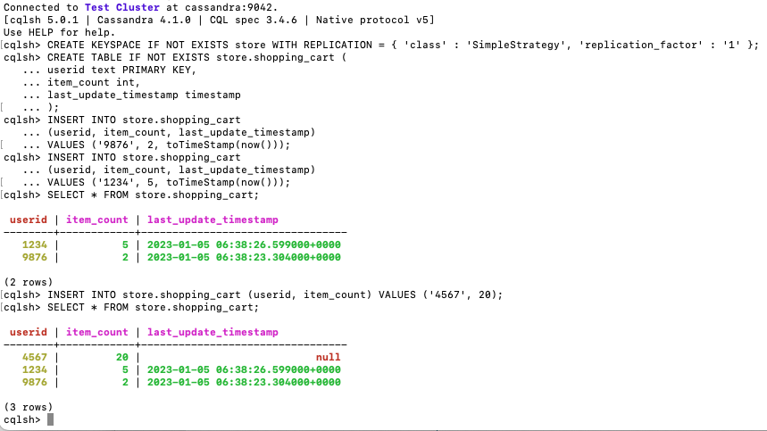

## Cassandra Masterclass

The notes are taken from:

- Cassandra: the Definitive Guide
- Getting Started with Apache Assandra

> Apache Cassandra is an open source, distributed, decentralized, elastically scalable, highly available, fault-tolerant, tuneably consistent, row-oriented database. Cassandra bases its distribution design on Amazon’s Dynamo and its data model on Google’s Bigtable, with a query language similar to SQL. Created at Facebook, it now powers cloud-scale applications across many industries.

### Getting Started

- download from [cassandra.apache.org](cassandra.apache.org)
- no master-vs-slave node distinction, all nodes are the same
- example use case: fraud detection, fiannce, geo-location, gaming. See [planetcassandra.org](planetcassandra.org)
  - product catalog, playlist, e.g. Netflix
  - recommendation/personalization
  - sensor, IOT
  - messaging
- The primary version for Cassandra 4.0 is Java 8
- production env uses linux (centos, redhat, debian, ubuntu)

```bash
# create folders for cassandar to write to
sudo mkdir /var/lib/cassandra
sudo mkdir /var/log/cassandra
sudo chown -R $USER:$GROUP /var/lib/cassandra
sudo chown -R $USER:$GROUP /var/log/cassandra

# start cassandra in background mode
# check for compatible Java version
bin/cassandra

# find process ID if running in background mode
ps aux | grep cassandra
kill -9 $process_id

# run in foreground mode (press cmd + c to kill)
bin/cassandra -f
```

- docker image starter [guide](https://cassandra.apache.org/_/quickstart.html)



### Architecture

Snithces: help nodes understand the cluster topology

- options: dynamic, simple, rack inferring, property file, gossip property snitch etc (see detail in documentation)
- property file snitch: every node needs to use the same snitch file, with the IP address of all nodes, data centers, racks

Gossip: how nodes in cluster communicate with each other

- every _second_, each node communicates with up-to-three other nodes
- Gossip is used for _internal_ communication
- CQL and Thrift is used for _external_ communication

Partitioner

- default is Murmur3 partitioner
- transform the partition columns to a number between -2^63~2^63 (aka token)
- token is placed on a wrapped ring (where 2^63 wraps to -2^63)
- N tokens divide the ring into N intervals, one for each node

Replication factor

- how many instances of the data will exist in a given database
- define replication factor for each database (keyspace)
- replicas are replicated in the next N consecutive nodes on the ring

Virtual Nodes

- default enabled in Cassandra, 256 virtual nodes in each physical node
- can assign higher number of Vnodes in high-power computer
- when new node is added, virtual nodes are distributed evenly without changing end-point value of existing nodes

```

```
