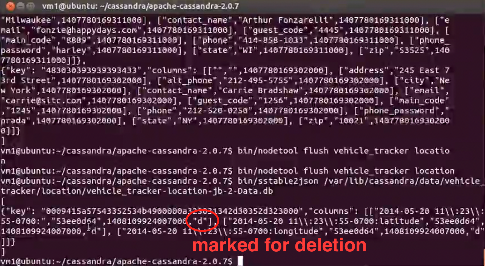

## Time-to-Live

- General syntax: `insert into ... using TTL 30;`
- expired records are marked with tombstone, and removed from disk after grace period

```sql
INSERT INTO location (vehicle_id, date, time, latitude, longitude)
VALUES ('AZWT3RSKI', '2014-05-20', '2014-05-20 11:23:55', 34.872689, -111.757373)
USING TTL 30;

-- will disappear after 30s
select * from location;

-- update a row's ttl (insert if not exist)
-- update applies to entire row, not fields
UPDATE location USING TTL 7776000
SET latitude = 34.872689, longitude = -111.757373
WHERE vehicle_id = 'AZWT3RSKI' AND date = '2014-05-20' AND time='2014-05-20 11:23:55';
```

### Behind-the-Scene

```bash
# flush
/opt/cassandra/bin/nodetool flush vehicle_tracker location

# check sstable
cd /var/lib/cassandra/data/vehicle_tracker/location-296270e0914d11ed9e1f47ec639afef9
```


